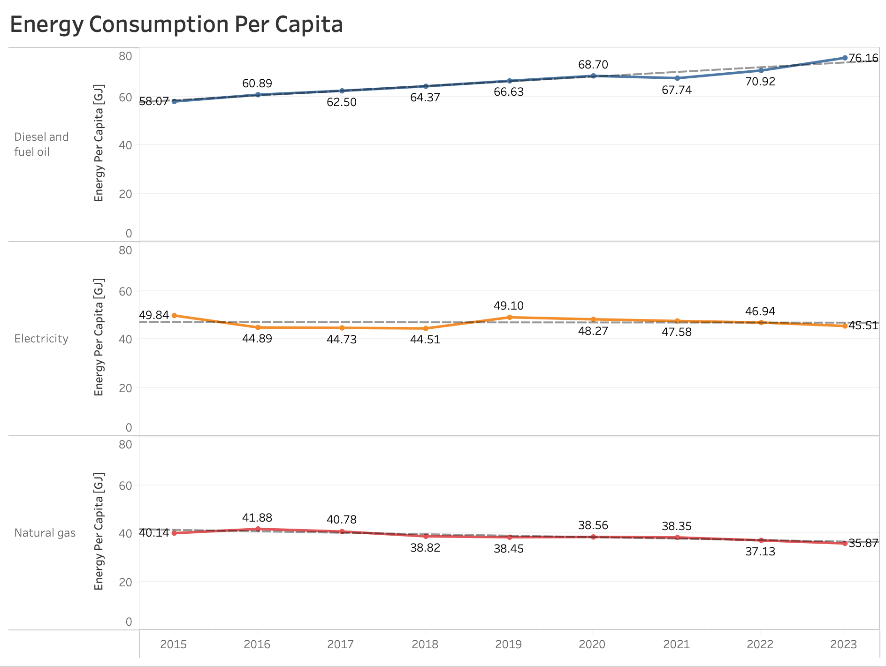
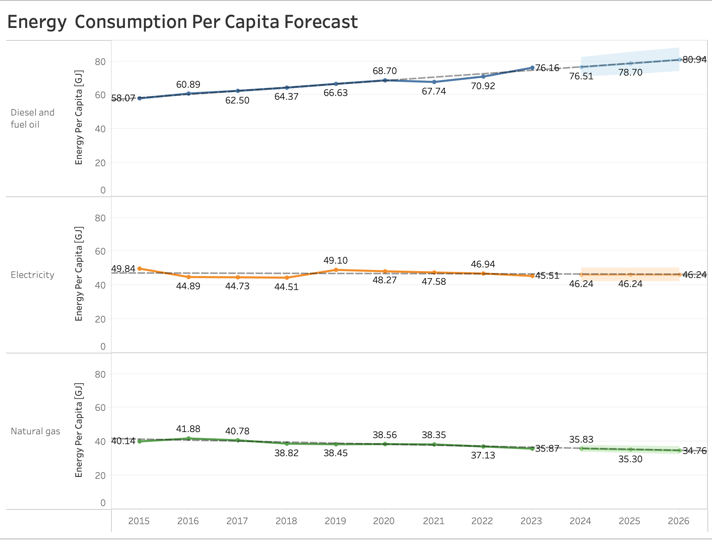

# 🇦🇺 Energy Consumption Analysis of Australia (2015–2023)

This project analyzes Australia’s energy consumption trends using data from the **Australian Bureau of Statistics (ABS)**.  
It combines the **Energy Account** and **Population** datasets to evaluate both **total consumption** and **per capita consumption**, along with a 3-year forecast (2024–2026).

🔗 View the interactive dashboard here:  
[Energy Consumption of Australia Story Presentation](https://public.tableau.com/app/profile/bugra.ozbek/viz/EnergyConsumptionofAustraliaStoryPresentation/EnergyConsumptionofAustralia?publish=yes)

---

##  Datasets

- **Energy Account (2015–2023)**  
  Source: ABS 46040DO0004 — Detailed physical end use of selected energy products.  
  Raw file: `Energy Account.xlsx`  
  Cleaned file (for Tableau): `Energy Account 2.xlsx`

- **Population (2001–2024)**  
  Source: ABS Regional Population data.  
  Raw file: `Population_2001-24.xlsx`  
  Cleaned file (for Tableau): `Population_2001-24 copy2.xlsx`

---

##  Data Preparation

### In Excel
- Original years were in the format `2014–15`, `2015–16`, etc. → converted to single years (`2015, 2016, … 2023`).  
- Removed unnecessary metadata rows (release info, table titles).  
- Dropped ABS-specific columns like `Supply/Use`, `Industry Code` that did not contribute to the analysis.  
- From the population dataset, kept only **Total Australia** and state totals (detailed regional breakdowns were dropped).  
- Aligned both datasets by keeping only years **2015–2023** so they match time-wise.

### In Tableau
- Pivoted both datasets (year columns → single `Year` column).  
- Converted `Year` from string → date to enable proper time-series behavior.  
- Created a calculated field for **Gigajoule (GJ)**: `Gigajoule = [PJ] * 1,000,000`  
- Created **Energy Per Capita (GJ)**: `Energy Per Capita (GJ) = [Gigajoule] / [Population]`  
- Applied a data source filter on Population to keep **Total Australia** only.  
- Blended Energy and Population on the **Year** field.

---

##  Visualisations

### 1. Per Capita Energy Consumption (2015–2023)

### 2. Per Capita Energy Consumption Forecast (2015–2026)

### 3. Total Energy Consumption of Australia (2015–2023)
.png)

---

##  Insights

 **Energy Per Capita (per person):**  
- **Electricity & Natural Gas** → both show a decline in per-capita use.  
   As population increases, individual energy demand becomes more efficient, or consumption shifts towards alternative energy sources.  
- **Diesel & Fuel Oil** → shows an increase per capita.  
   Even with population growth, usage per person is rising — likely linked to transport and logistics demand.  

 **Total Consumption (national):**  
- **Electricity** → total demand increases while per capita decreases.  
   Overall demand is population-driven, but efficiency gains reduce average individual usage.  
- **Natural Gas** → total remains flat, per capita decreases.  
   Indicates saturation or substitution by renewables/electrification.  
- **Diesel & Fuel Oil** → increases in both total and per capita.  
   The **most critical sustainability concern**, as growth is driven by both population and per-person demand.

---

##  Limitations
- ABS data contains **“np” (Not Published)** and **“-” (Not Available)** values.  
- These were kept as **NULL** for transparency. While they do not affect per-capita ratios significantly, they limit the completeness of sector-level insights.  
- Forecasting is based on Tableau’s time-series model (no external policy/economic adjustments).

---

##  How to Explore
- Open the dashboard:  
  [Energy Consumption of Australia Story Presentation](https://public.tableau.com/app/profile/bugra.ozbek/viz/EnergyConsumptionofAustraliaStoryPresentation/EnergyConsumptionofAustralia?publish=yes)

---

## 📂 Project Structure

---

 **Author:** Bugra Ozbek  
 Master of Business Analytics (Advanced), Torrens University Australia

